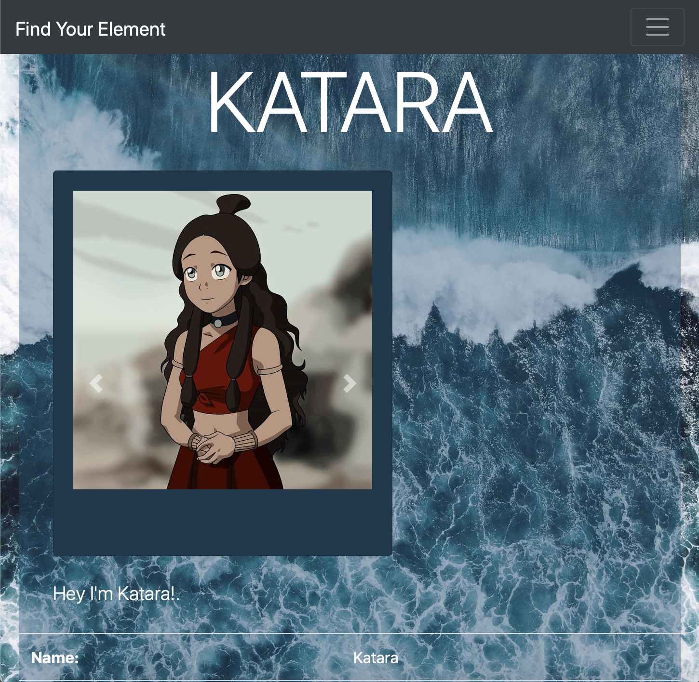
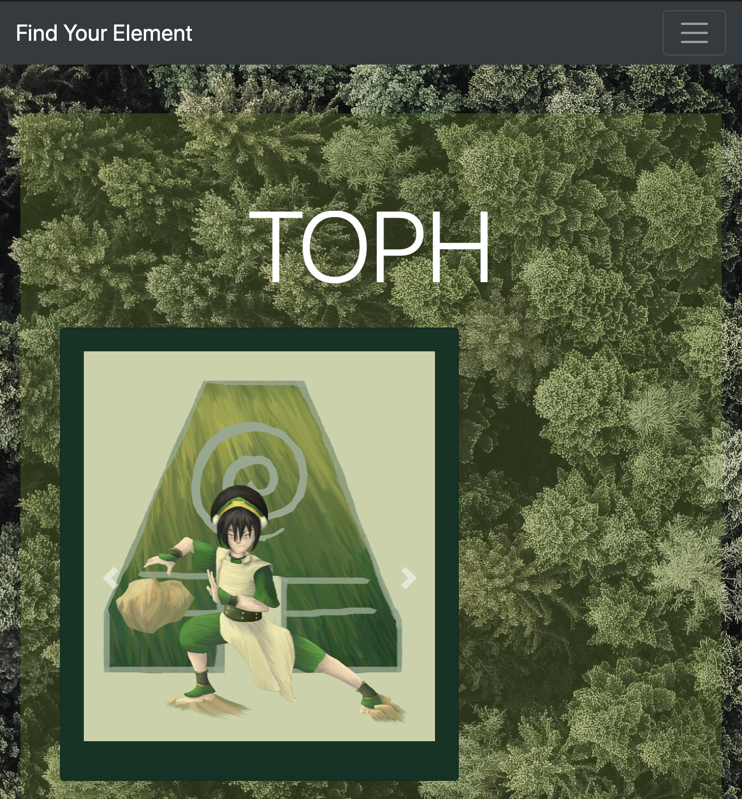
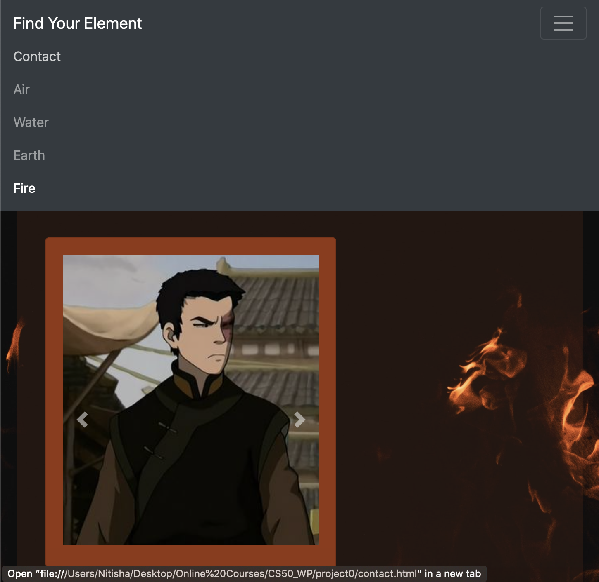
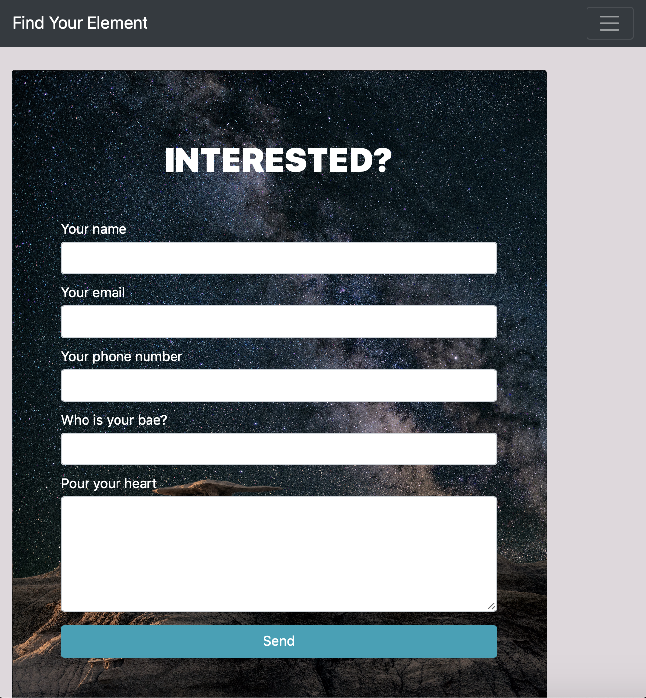

# CS50 Project 0

As a part of *CS50 - Web Programming with Python and JavaScript*, this project is a website created using HTML, CSS, and Bootstrap.

This is a "dating profile" for four of the main characters from Avatar: The Last Airbender. This website is responsive and uses an array of features that Bootstrap provides, including but not limited to: *Navigation Bars, Card Decks, Jumbotron, Tables, Forms, Card Images, and Image Carousels*.

 

<!--  -->

 
 

 

